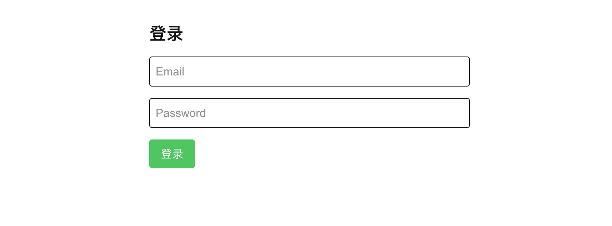
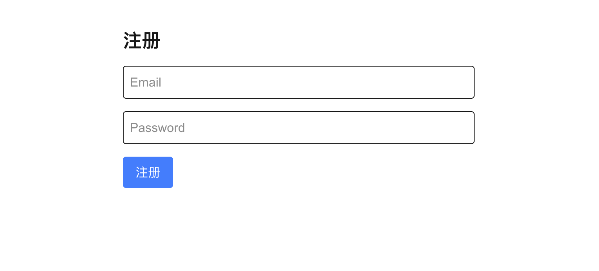
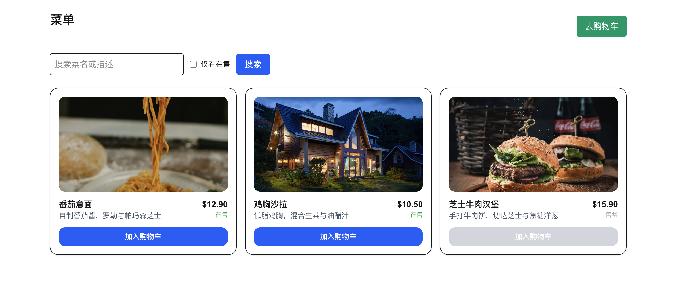
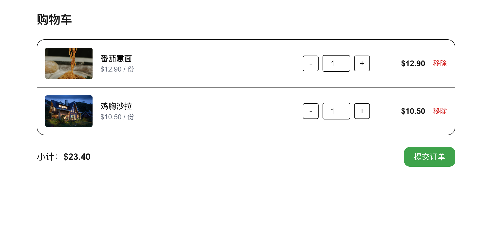
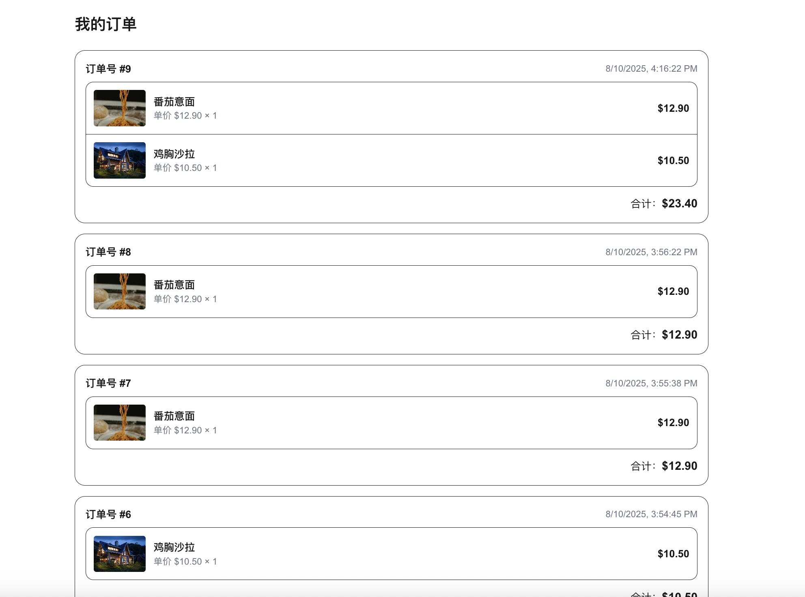
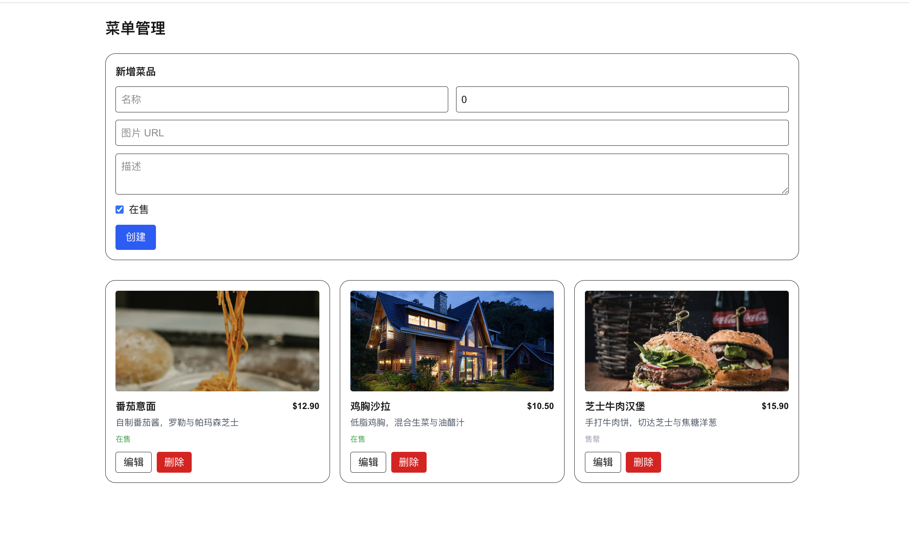

# 🍽 Mealmate - Meal Management System

**Mealmate** is a simple meal management system built with **Next.js**, **TypeScript**, **Tailwind CSS**, and **Prisma ORM**.  
It allows customers to browse menus, add items to their cart, place orders, and for admins to manage menu items and orders.

---

## 🚀 Tech Stack

- **Next.js** – React framework for building modern web apps
- **TypeScript** – Type-safe JavaScript
- **Tailwind CSS** – Utility-first CSS framework
- **Prisma** – Type-safe ORM for database access
- **PostgreSQL** – Relational database
- **JWT Authentication** – User login & registration
- **LocalStorage** – Client-side cart persistence

---

## 📸 Screenshots

### 1️⃣ Login Page： http://localhost:3000/auth/login


Users can log in with their email and password to access their account.

### 2️⃣ Register Page: http://localhost:3000/auth/register


New users can create an account by filling in their details.

### 3️⃣ Menu Page: http://localhost:3000/menu


Displays all available menu items with images, descriptions, and prices.

### 4️⃣ Cart Page: http://localhost:3000/cart


Shows the items added to the cart, allows updating quantities or removing items.

### 5️⃣ Orders Page: http://localhost:3000/orders


Displays a list of past orders placed by the user.

### 6️⃣ Admin Menu Management Page: http://localhost:3000/admin/menu

Login with admin account to access this admin/menu page

Allows admins to add, update, and delete menu items.

---

## 🛠 How to Run Locally

```bash
# Install dependencies
npm install

# Start the development server
npm run dev

# Open http://localhost:3000 in your browser
```
